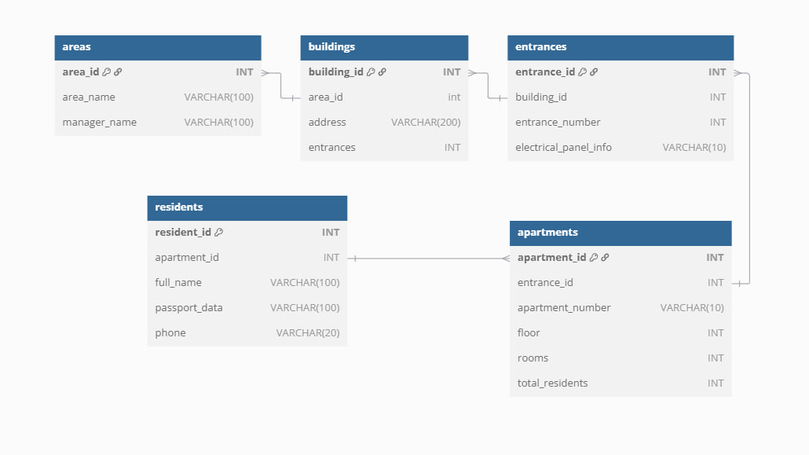
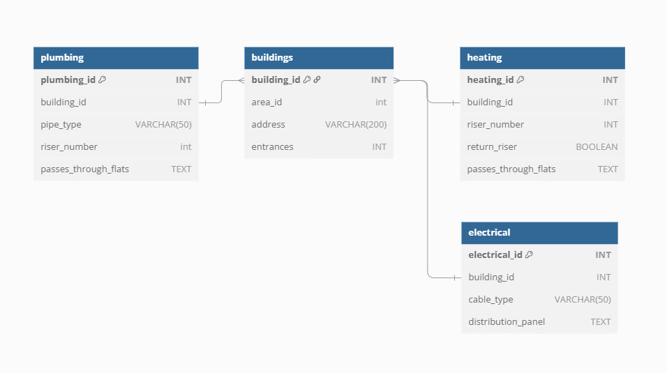
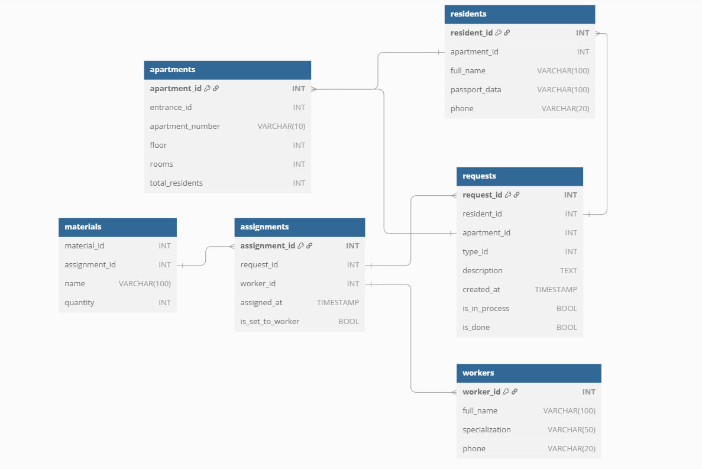
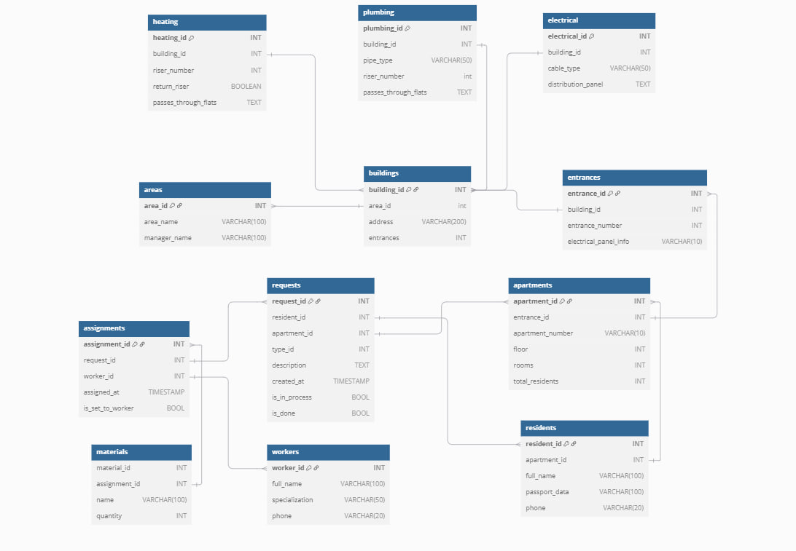

# Cхема информации о жильцах по районам


```sql
TABLE areas {
    area_id INT [primary key]
    area_name VARCHAR(100)
    manager_name VARCHAR(100)
}

TABLE buildings {
    building_id INT [primary key]
    area_id int
    address VARCHAR(200)
    entrances INT
}
Ref: areas.area_id > buildings.area_id

TABLE entrances {
    entrance_id INT [primary key]
    building_id INT 
    entrance_number INT
    electrical_panel_info VARCHAR(10)
}
Ref: buildings.building_id > entrances.building_id

TABLE apartments {
    apartment_id INT [primary key]
    entrance_id INT 
    apartment_number VARCHAR(10)
    floor INT
    rooms INT
    total_residents INT
}
Ref: entrances.entrance_id > apartments.entrance_id

TABLE residents {
    resident_id INT [primary key]
    apartment_id INT 
    full_name VARCHAR(100)
    passport_data VARCHAR(100)
    phone VARCHAR(20)
}
Ref: apartments.apartment_id > residents.apartment_id

```

# Cхема разводки коммуникаций


```sql
TABLE buildings {
    building_id INT [primary key]
    area_id int
    address VARCHAR(200)
    entrances INT
}

TABLE plumbing {
    plumbing_id INT [primary key]
    building_id INT 
    pipe_type VARCHAR(50) 
    riser_number int
    passes_through_flats TEXT
}
Ref: buildings.building_id > plumbing.building_id

TABLE heating {
    heating_id INT [primary key]
    building_id INT
    riser_number INT
    return_riser BOOLEAN
    passes_through_flats TEXT
}
Ref: buildings.building_id > heating.building_id

TABLE electrical {
    electrical_id INT [primary key]
    building_id INT 
    cable_type VARCHAR(50)
    distribution_panel TEXT
}
Ref: buildings.building_id > electrical.building_id

```

# Cхема распределения заявок


```sql
TABLE apartments {
    apartment_id INT [primary key]
    entrance_id INT 
    apartment_number VARCHAR(10)
    floor INT
    rooms INT
    total_residents INT
}

TABLE residents {
    resident_id INT [primary key]
    apartment_id INT 
    full_name VARCHAR(100)
    passport_data VARCHAR(100)
    phone VARCHAR(20)
}
Ref: apartments.apartment_id > residents.apartment_id

TABLE requests {
    request_id INT [primary key]
    resident_id INT 
    apartment_id INT 
    type_id INT
    description TEXT
    created_at TIMESTAMP
    is_in_process BOOL
    is_done BOOL
}
Ref: apartments.apartment_id > requests.apartment_id
Ref: residents.resident_id > requests.resident_id

TABLE workers {
    worker_id INT [primary key]
    full_name VARCHAR(100) 
    specialization VARCHAR(50)
    phone VARCHAR(20)
}

TABLE assignments {
    assignment_id INT [primary key]
    request_id INT 
    worker_id INT 
    assigned_at TIMESTAMP 
    is_set_to_worker BOOL
}
Ref: requests.request_id > assignments.request_id
Ref: workers.worker_id > assignments.worker_id

TABLE materials {
    material_id INT
    assignment_id INT 
    name VARCHAR(100)
    quantity INT
}
Ref: assignments.assignment_id > materials.assignment_id

```


# Полная схема базы данных


```sql
TABLE areas {
    area_id INT [primary key]
    area_name VARCHAR(100)
    manager_name VARCHAR(100)
}

TABLE buildings {
    building_id INT [primary key]
    area_id int
    address VARCHAR(200)
    entrances INT
}
Ref: areas.area_id > buildings.area_id

TABLE entrances {
    entrance_id INT [primary key]
    building_id INT 
    entrance_number INT
    electrical_panel_info VARCHAR(10)
}
Ref: buildings.building_id > entrances.building_id

TABLE apartments {
    apartment_id INT [primary key]
    entrance_id INT 
    apartment_number VARCHAR(10)
    floor INT
    rooms INT
    total_residents INT
}
Ref: entrances.entrance_id > apartments.entrance_id

TABLE residents {
    resident_id INT [primary key]
    apartment_id INT 
    full_name VARCHAR(100)
    passport_data VARCHAR(100)
    phone VARCHAR(20)
}
Ref: apartments.apartment_id > residents.apartment_id


TABLE plumbing {
    plumbing_id INT [primary key]
    building_id INT 
    pipe_type VARCHAR(50) 
    riser_number int
    passes_through_flats TEXT
}
Ref: buildings.building_id > plumbing.building_id

TABLE heating {
    heating_id INT [primary key]
    building_id INT
    riser_number INT
    return_riser BOOLEAN
    passes_through_flats TEXT
}
Ref: buildings.building_id > heating.building_id

TABLE electrical {
    electrical_id INT [primary key]
    building_id INT 
    cable_type VARCHAR(50)
    distribution_panel TEXT
}
Ref: buildings.building_id > electrical.building_id


TABLE requests {
    request_id INT [primary key]
    resident_id INT 
    apartment_id INT 
    type_id INT
    description TEXT
    created_at TIMESTAMP
    is_in_process BOOL
    is_done BOOL
}
Ref: apartments.apartment_id > requests.apartment_id
Ref: residents.resident_id > requests.resident_id

TABLE workers {
    worker_id INT [primary key]
    full_name VARCHAR(100) 
    specialization VARCHAR(50)
    phone VARCHAR(20)
}

TABLE assignments {
    assignment_id INT [primary key]
    request_id INT 
    worker_id INT 
    assigned_at TIMESTAMP 
    is_set_to_worker BOOL
}
Ref: requests.request_id > assignments.request_id
Ref: workers.worker_id > assignments.worker_id

TABLE materials {
    material_id INT
    assignment_id INT 
    name VARCHAR(100)
    quantity INT
}
Ref: assignments.assignment_id > materials.assignment_id

```

