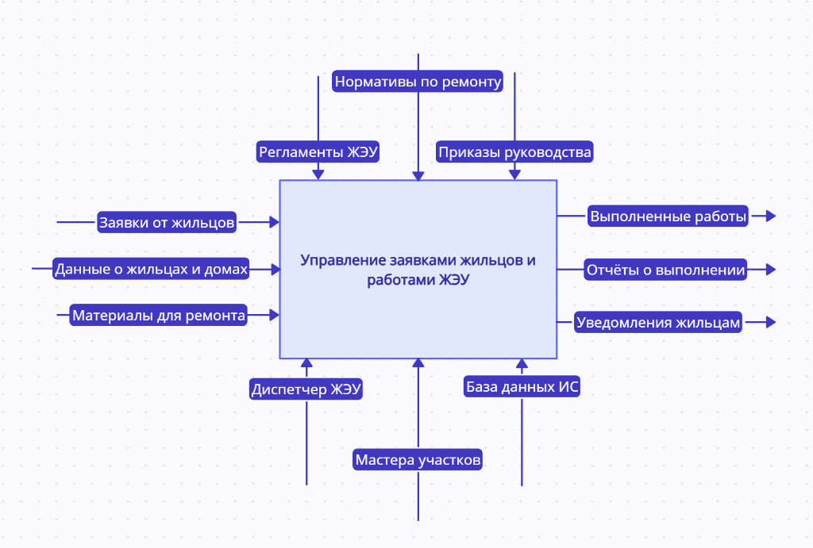

# Анализ предметной области и выделение аспектов функционирования
Система должна охватывать:
1. Управление жилым фондом (дома, участки, подъезды, квартиры).
2. Учёт коммуникаций (водоснабжение, канализация, отопление, электрика).
3. Учёт жильцов (ФИО, паспортные данные, состав семьи).
4. Обработка заявок (регистрация, назначение мастеров, контроль выполнения).
5. Учёт материалов (использованные при ремонте).

**Основная функция системы** – автоматизация учёта и обработки заявок жильцов с контролем выполнения работ.

# Контекстная диаграмма

# Декомпозиция контекстной диаграммы
1. "Регистрация и обработка заявок"
- Вход: заявка от жильца (тип проблемы, адрес).
- Выход: заявка в работе/закрыта.
- Управление: регламент приёма заявок.

2. "Назначение и выполнение работ"
- Вход: заявка, доступные мастера.
- Выход: отчёт о выполненной работе.
- Управление: график работ, приоритеты.

3. "Учёт материалов"
- Вход: списанные материалы.
- Выход: отчёт по расходу.
- Управление: нормы списания.